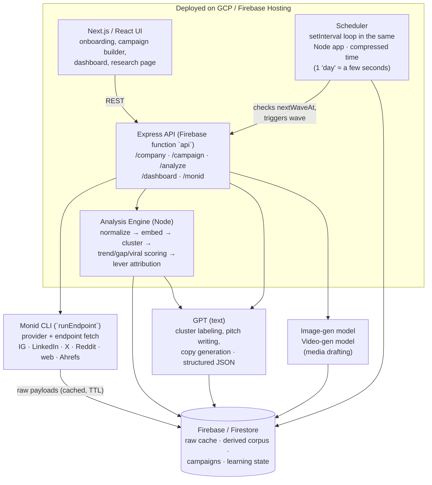

# Campco

**An autonomous, self-improving organic content engine for marketing teams.**

Built for the AINU Chatathon (Sept 19, 2026) — Track 3: ProsperiFi (AI-powered content marketing).

---

## The Problem

Marketing teams spend huge amounts of time on organic social content: researching what's working, figuring out what to post, drafting it, publishing it, and then trying to learn from the results — usually manually, and usually too slowly to act on what they learn.

Campco automates that whole loop: research → campaign generation → publish → A/B test → refine, continuously.

---

## Who It's For

Anyone responsible for a company's marketing: founders, in-house marketers, or marketing teams who want organic (non-paid) content that's grounded in real data about their brand, their audience, and their competitors — not generic AI copy.

---

## How It Works

### 1. Onboarding
- User signs up and provides their **company website** plus optional **Instagram, LinkedIn, X, and Reddit** URLs.
- They select which of the four supported platforms they want to run campaigns on: **Instagram, LinkedIn, X, Reddit**.
- The system pulls in their product page, website, and social presence.
- An LLM expands on this raw data (with **Monid** doing the underlying data collection) to figure out what the company actually does, and to propose competitors and audience groups.
- The user reviews/checks off what's correct before moving on.

### 2. Creating a Campaign
- User describes the campaign: what they're trying to market, the goal, and a **campaign calendar** (start/end dates).
- The system recommends:
  - **Audiences** to target
  - **Similar companies / competitors** in the space (via Monid, e.g. Ahrefs organic competitors from the company domain)
- The user can add, remove, or manually attach new audiences and data sources at this stage.
- **Writing style** is inferred automatically from the company's own past posts and/or competitor posts — no manual style guide needed.

### 3. Campaign Suggestions
- Once research completes, the system generates **campaign suggestions**, each grounded in one of:
  - A **trend** identified in the target audience
  - A **gap** — a problem the audience is talking about that isn't being addressed
  - A **recent viral moment** that competitors haven't capitalized on
- The user picks from these suggestions (and can add more manually).
- For each selected campaign, the system drafts media suited to the platform(s) chosen for that campaign.

### 4. Approval, Publishing & A/B Testing
- Once a campaign is approved, Campco:
  1. Publishes the drafted media in waves (**simulated/mocked for this demo** — no live posting to real platforms yet).
  2. Collects performance analytics on each wave.
  3. **A/B tests**: e.g., 4 pieces of media per wave — 2 as "version A," 2 as "version B" — all four go out, analytics come back, and the next wave is refined using those insights.
- This creates an **autonomous, self-improving content loop** that keeps optimizing without manual intervention.

### 5. Dashboard
- Shows performance across all active campaigns.
- Surfaces qualitative insights (not just raw numbers).
- Includes billing/spend tracking.
- This is purely an **organic content optimization tool** — no paid ad spend or ad-platform integration.

### 6. Research Page (standalone)
- Independent of the campaign flow, built on the same underlying infrastructure.
- Lets a user select any companies or audiences and see what's trending in their content, without needing to run a campaign.
- Reuses the same `POST /analyze/company` and `POST /analyze/audience` building blocks as the main product.

---

## Architecture

### System diagram

### Design decisions for this build
- **No separate Python service.** Originally scoped as Node + Python, but for the hackathon everything lives in Node — simplest path to a working demo.
- **One API, not two.** Next.js talks to a single Express app mounted as the Firebase `api` function. No Next.js API routes duplicating the same resources.
- **No auth.** Skipped entirely for the demo; would be Firebase Auth in a real build.
- **Simple in-process scheduler, not a real queue.** A `setInterval` loop running inside the same Node app checks every campaign's `nextWaveAt` timestamp and fires the next wave when it's due. Time is **compressed for the demo** — a "day" between waves is a few seconds — so judges can watch multiple refinement cycles happen live instead of waiting. A real version would replace this with Cloud Tasks/Celery/a proper worker and real-world timing.
- **Publishing is mocked.** No real Instagram/LinkedIn/X/Reddit API calls — publish step fabricates plausible analytics instead.
- **Math narrows, the LLM explains.** Trend/gap/viral detection is deterministic scoring over normalized engagement data; GPT only labels clusters and writes the pitch from evidence it's handed. Nothing is "asked" of the model that can be computed.
- **Aggressive caching over re-scraping.** Raw Monid payloads are cached with a TTL and shared across onboarding, campaigns, and the research page — the single biggest lever on both cost and demo-day latency.

### Monid: how data collection actually works

Monid is a **tool router** — one key, one CLI, access to 200+ underlying tools (social scrapers, search, web extraction, SEO) with built-in budget controls. Campco never writes or maintains four separate platform scrapers.

Every Monid call goes through the same wrapper: `runEndpoint(provider, endpoint, { query, body, path })` → `monid run -p <provider> -e <endpoint>`. The Express app exposes those fetches (and the product routes that use them). Discovery does not need MCP: if handles or competitors are unknown, GPT chooses provider + endpoint + params, then Node runs that endpoint. After that, code calls a known endpoint directly.

| Kind of call | When | Why |
|---|---|---|
| **Discovery** | Onboarding, competitor/audience suggestions | Website/domain in, GPT or code picks the Monid endpoint (e.g. Ahrefs organic competitors). Same `runEndpoint` path. |
| **Fetch** | Every pull after handles exist | Known provider + endpoint. Cheaper, faster, cacheable, and no LLM in the loop for something that doesn't need judgment. |

**Fetch plan per stage:**

| Stage | What Monid pulls | Approx. calls |
|---|---|---|
| Onboarding | Company profiles on 4 platforms, website + product page extraction, last ~50 own posts per platform | ~10–15 |
| Competitor discovery | Domain → candidate competitors (`POST /monid/competitors`) → profile lookups | ~5–10 |
| Competitor corpus | Last ~50 posts per competitor per relevant platform | ~4 per competitor |
| Audience corpus | Subreddit/hashtag/topic-level posts + comments for each audience | ~5 per audience |
| Research page | Same two primitives (`/analyze/company`, `/analyze/audience`), hitting the same cache | varies |

**Caching is the load-bearing design choice.** Scraping is the slowest and most expensive step, and the research page, onboarding, and every campaign all want the *same* underlying data. So:

- Raw Monid payloads are written to `rawFetches` verbatim, keyed by `(platform, handle, endpoint)` with a `fetchedAt` timestamp and TTL (24h for the demo).
- Derived data (`posts`, `topics`) is computed from the cache, never re-scraped.
- A cache hit costs ~0 and returns instantly — which is also what makes a live demo survivable if conference wifi is bad.

**Budget controls map directly to the product.** Monid's per-agent spend caps are what the dashboard's billing/spend panel actually reports on — cost per campaign is a real number (Monid tool spend + LLM tokens + media generation), not a placeholder.

---

### AI analysis: what's actually computed vs. generated

The weakest version of this product is "throw scraped posts at GPT and ask what's trending." Campco splits it deliberately: **math narrows, the LLM explains.**

#### Step 0 — Normalize everything into one corpus

All scraped content lands in a single `posts` collection regardless of platform, with a normalized shape. Raw engagement counts are useless for comparison (a 500-like Instagram post from a 200k-follower brand is a flop; the same on a 2k-follower account is a hit). So every post gets:

- `engagementRate = (likes + comments + shares) / followerCount` at fetch time
- `zScore` — that post's engagement rate against **its own account's trailing baseline**, so we're measuring "unusual for them," not "big number"

This normalization is what makes cross-platform and cross-account comparison meaningful at all.

#### Step 1 — Topic extraction (embeddings, not vibes)

Posts are embedded and clustered. The LLM's only job is to *label* the resulting clusters — it never decides what the topics are. This prevents the classic failure mode where the model invents plausible-sounding topics that aren't in the data.

Each resulting `topic` carries: label, member post IDs, volume over time, mean engagement, and which accounts/audiences it appears in.

#### Step 2 — The three detectors (deterministic scoring)

Each signal type has an actual definition, computed before any LLM is involved:

| Signal | Definition | Computed as |
|---|---|---|
| **Trend** | A topic rising in both volume and engagement within the audience | Volume and mean engagement in the recent window vs. the trailing window; both must be up |
| **Gap** | Something the audience engages with heavily that neither you nor competitors cover | High audience engagement on a topic × low coverage score across own + competitor corpora |
| **Viral** | A single recent breakout the competition hasn't responded to | Post `zScore` over threshold, recent, and no competitor post in that topic cluster since |

Each candidate gets a score and the **evidence post IDs that produced it**. This matters: every suggestion the user sees can be traced back to specific real posts.

#### Step 3 — LLM writes the pitch, not the finding

Top-scoring candidates go to GPT, which turns each into a campaign suggestion: the angle, why it fits this company, and the rationale — grounded in the evidence posts it was handed. Output is **typed JSON against a fixed schema** (every LLM call in Campco is structured output; nothing is parsed out of prose).

#### Step 4 — Style inference

Style is extracted once per company from its own top-performing posts and stored as a structured `styleProfile` (tone, sentence length, emoji/hashtag usage, opening patterns, vocabulary) rather than a vague prose description. Every generation call takes this as explicit constraints, which is what keeps output from sounding like generic AI copy.

#### Step 5 — The A/B loop actually learns something

"Version A beat version B" teaches you nothing reusable. So variants differ along **explicit levers**:

| Lever | Example values |
|---|---|
| `hook` | question · bold claim · statistic · story |
| `format` | single image · carousel · video · text-only |
| `tone` | authoritative · casual · contrarian |
| `cta` | none · soft · direct |
| `length` | short · medium · long |

Each piece of media records its lever assignment. After a wave, results are attributed **per lever value**, not per variant — so the system learns "question hooks outperform statistic hooks for this audience," which carries into every future wave.

Lever stats are stored per `(campaign, lever, value)` as a running win/loss + mean-lift record, and the next wave biases generation toward winning values while still exploring — a simple multi-armed-bandit-style balance rather than pure exploitation.

**Honest caveat worth stating to judges:** with 4 posts per wave, nothing here is statistically significant. It's a directional heuristic that gets meaningful with volume. The architecture is right; the sample size in a demo isn't.

---

### Data model (Firestore)

Deliberately split into **raw → derived → campaign → learning** layers, so expensive scraping is cached once and reused everywhere.

**Raw layer** (cache, never edited)

| Collection | Key fields |
|---|---|
| `rawFetches` | platform, handle, endpoint, payload, fetchedAt, ttl, monidCost |

**Derived layer** (shared by campaigns *and* the research page)

| Collection | Key fields |
|---|---|
| `companies` | name, platforms[], resolvedHandles{}, productSummary, styleProfile, followerCounts{} |
| `accounts` | type (`own` \| `competitor`), platform, handle, followerCount, baselineEngagementRate |
| `audiences` | name, platform, source (subreddit/hashtag/topic), memberAccountIds[] |
| `posts` | accountId \| audienceId, platform, text, mediaUrls[], postedAt, likes, comments, shares, `engagementRate`, `zScore`, embedding, topicId |
| `topics` | label, postIds[], volumeByWindow{}, meanEngagement, coverageScore, scope (audience/competitor/own) |
| `signals` | type (`trend` \| `gap` \| `viral`), topicId, score, evidencePostIds[], computedAt |

**Campaign layer**

| Collection | Key fields |
|---|---|
| `campaigns` | companyId, goal, startDate, endDate, platforms[], audienceIds[], competitorIds[], status, currentWave, nextWaveAt |
| `suggestions` | campaignId, signalId, angle, rationale, platform, selected |
| `waves` | campaignId, waveNumber, status, publishedAt, analyzedAt, refinementSummary |
| `media` | campaignId, waveId, suggestionId, variant, platform, type, copy, mediaUrl, `levers{}`, status |
| `analytics` | mediaId, impressions, likes, comments, shares, `engagementRate`, `zScore`, collectedAt |

**Learning layer**

| Collection | Key fields |
|---|---|
| `leverStats` | campaignId, lever, value, trials, wins, meanLift |
| `runs` | campaignId, stage, model/tool used, tokens, monidCost, latency, status |

`runs` exists so the spend dashboard has real per-stage cost data and so failures are debuggable mid-demo.

---

### API surface

Single Express app, exported as Firebase function `api`.

- Local: `http://localhost:5001/chatathon-2026/us-central1/api`
- Prod: `https://us-central1-chatathon-2026.cloudfunctions.net/api`

Long-running research is kicked off and polled rather than blocking a request. The research page and campaign research both call `/analyze/*`; they do not have a third parallel research API. Media lives under campaign waves, not a separate `/media` root. Competitor lookup is `/monid/competitors`, used by onboarding and campaign create.

**Monid fetches**

| Route | Does |
|---|---|
| `GET /health` | Liveness |
| `POST /monid/competitors` | Domain → organic competitors (Ahrefs). Onboarding/campaign discovery uses this instead of a second competitor API. |

**Onboarding**

| Route | Does |
|---|---|
| `POST /company/resolve` | Website + optional social URLs + platforms → Monid fetches (site/product extraction, profiles, `/monid/competitors`) → draft profile for user confirmation |
| `POST /company/:id/confirm` | User-corrected profile → own-post corpus via `/analyze/company` + `styleProfile` extraction |

**Analyze primitives** (research page and campaigns)

| Route | Does |
|---|---|
| `POST /analyze/company` | Fetch (or cache-hit) an account's corpus → normalize → embed → topics |
| `POST /analyze/audience` | Same, for an audience/subreddit/hashtag |

**Campaign lifecycle**

| Route | Does |
|---|---|
| `POST /campaign` | Create: goal, calendar, platforms. Recommends audiences + competitors (via `/monid/competitors`) for user editing |
| `PATCH /campaign/:id/scope` | Add/remove audiences, competitors, data sources |
| `POST /campaign/:id/research` | Orchestrates `/analyze/company` and `/analyze/audience` across campaign scope → returns `runId` |
| `GET /campaign/:id/research/status` | Poll: progress, cache hit rate, cost so far |
| `GET /campaign/:id/suggestions` | Runs the three detectors → LLM pitches → suggestion cards with evidence posts attached |
| `POST /campaign/:id/approve` | Select suggestions → generate wave 1 media (copy + visuals, lever-assigned) → set `nextWaveAt` |

**The loop** (scheduler-driven, not user-facing)

| Route | Does |
|---|---|
| `POST /campaign/:id/wave/publish` | Mock-publishes the due wave. Idempotent on `waveNumber` so a scheduler retry can't double-post |
| `POST /campaign/:id/wave/collect` | Generates mock analytics for published media |
| `POST /campaign/:id/wave/refine` | Attributes results per lever → updates `leverStats` → generates the next wave biased toward winners → sets `nextWaveAt` |
| `POST /campaign/:id/pause` · `/resume` | Demo control over the scheduler |

**Dashboard**

| Route | Does |
|---|---|
| `GET /dashboard` | Cross-campaign performance, wave-over-wave lift, top lever findings, and spend rolled up from `runs` |

---

## Tech Stack

| Layer | Choice |
|---|---|
| Frontend | Next.js / React |
| Backend | Express on Firebase Cloud Functions (Node 22) |
| Database | Firebase / Firestore |
| Data collection | Monid CLI via `runEndpoint` — GPT picks endpoints for discovery, then cached deterministic fetch |
| Topic extraction | Embeddings + clustering (LLM labels clusters only) |
| Text / pitch / copy LLM | GPT, structured JSON output on every call |
| Image generation | Dedicated image-gen model |
| Video generation | Dedicated video-gen model |
| Publishing (demo) | Simulated/mocked — no live platform posting yet |

Repo: https://github.com/Yurika-Kan/chatathon

---

## Team

4–5 people, built for the AINU Chatathon (Raytheon Amphitheatre, Egan Research Center) — demo day: **September 19, 2026**.

---

## Current Scope (Hackathon MVP)

**In scope:**
- Onboarding + company/audience research via Monid + LLM
- Campaign creation with calendar, audience/competitor selection, style inference
- Trend/gap/viral-based campaign suggestions
- Media drafting per platform
- Simulated publish + analytics + A/B refinement loop
- Performance dashboard
- Standalone research page

**Out of scope (for now):**
- Live publishing to real social platforms (Instagram/LinkedIn/X/Reddit APIs)
- Real ad spend / paid campaigns (organic only)
- Real billing/payments integration

---

## Roadmap (Post-Hackathon)

- Replace mocked publishing with real platform APIs
- Real-money billing and spend tracking
- Expand supported platforms beyond the initial four
- Deeper personalization of writing style per audience segment
